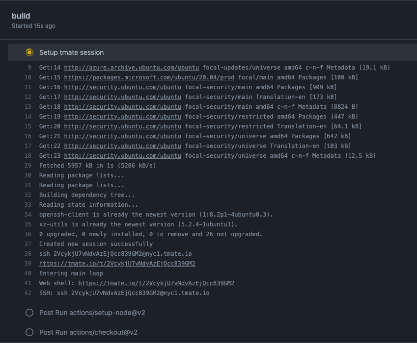

# Debug your [GitHub Actions](https://github.com/features/actions) by using tmate

This GitHub Action offers you a direct way to interact with the host system on which the actual scripts (Actions) will run.

## Features

- Debug your GitHub Actions by using SSH
- Continue your Workflows afterwards

## Supported Operating Systems

- `Linux`
- `macOS`
- (`Window` is **not** supported. It will be skipped so that the Pipeline does not fail)

## Getting Started

By using this minimal example a [tmate](https://tmate.io) session will be created.

```yaml
name: CI
on: [push]
jobs:
  build:
    runs-on: ubuntu-latest
    steps:
    - uses: actions/checkout@v2
    - name: Setup tmate session
      uses: mxschmitt/action-tmate@v2
```

To get the connection string, just open the `Checks` tab in your Pull Request and scroll to the bottom. There you can connect either directly per SSH or via a web based terminal.



## Continue a workflow

If you want to continue a workflow and you are inside a tmate session, just create a empty file with the name `continue` either in the root directory or in the project directory by running `touch continue` or `sudo touch /continue`.

## Connection string / URL is not visible

The connection string will be written in the logs every 5 seconds. For more information checkout issue [#1](https://github.com/mxschmitt/action-tmate/issues/1).
